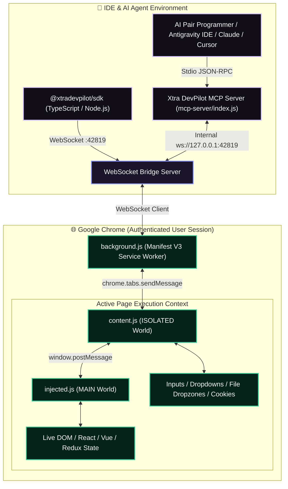

# Xtra DevPilot 🚀

> **The Local-First AI Browser Bridge for Developers & AI Agents (v2.0)**  
> Seamlessly connect Google Antigravity, Claude Desktop, Cursor, and autonomous AI agents directly to your real, authenticated Google Chrome browser via the Model Context Protocol (MCP).

[](https://github.com/om0852/XtraDevPilot)
[](https://modelcontextprotocol.io/)
[](https://developer.chrome.com/docs/extensions/)
[](#-master-tools-catalog-33-live-verified-tools)
[](#%EF%B8%8F-system-architecture)
[](LICENSE)

---

## ⚡ Why Xtra DevPilot?

Traditional headless automation tools (Puppeteer, Selenium, raw Playwright) fail when dealing with modern authentication, Cloudflare bot challenges, CAPTCHAs, SSO sessions, and complex React/Vue state.

**Xtra DevPilot** operates inside your **real Google Chrome browser** where your logins, cookies, credentials, and extensions already live. With a local sub-12ms WebSocket bridge (`ws://127.0.0.1:42819`) and 33 purpose-built MCP tools, it empowers developers and AI agents to inspect, automate, debug, and scrape any web application with zero bot detection.

---

## 👥 Built For Every Modern Web Persona

| Persona | Key Capabilities & Unlocked Superpowers |
| :--- | :--- |
| **🚀 Full-Stack Developers** | Evaluate runtime JS in the page's `MAIN` execution context (access Redux stores, Zustand, Pinia, globals); inject live CSS stylesheets without reloads; diagnose CSS box model and margin bugs with instant layout debug outlines. |
| **🤖 Autonomous AI Agents** | Token-optimized DOM extraction (`get_clean_dom_snapshot` strips SVGs and styles to save up to **94% LLM context tokens**); full multi-tab situational awareness; high-resilience Tailwind CSS selector normalization. |
| **🧪 QA & Automation Teams** | 1-click live user session recording that compiles directly into production-ready **Playwright** test scripts (`record_user_flow`); deterministic assertion engine (`assert_element_state`); in-browser network response mocking (`mock_network_response`). |
| **📊 Data & Scraping Engineers** | Universal table, grid, and card extraction (`extract_structured_data`); automated ATS job description parsing (`extract_job_details`); bi-directional smooth scrolling; full CRUD on cookies, `localStorage`, and `sessionStorage`. |

---

## 🏛️ System Architecture



---

## 🧰 Master Tools Catalog (33 Live-Verified Tools)

All 33 tools have been verified with 100% pass rates against active Chrome sessions:

### 1. 🗂️ Tabs & Window Management
| Tool Name | Description | Key Arguments |
| :--- | :--- | :--- |
| `list_tabs` | Lists all open Chrome tabs with their unique IDs, titles, URLs, and active states. | _None_ |
| `open_tab` | Opens a new browser tab in Chrome and navigates immediately to the URL. | `url` *(required)* |
| `navigate` | Navigates the active or specified tab to a new URL, waiting for DOM readiness. | `url` *(required)*, `tabId` |
| `get_tab_info` | Retrieves metadata (title, URL, dimensions, favicon, status) for a tab. | `tabId` |
| `set_viewport_size` | Resizes the Chrome window to test responsive design breakpoints (mobile, tablet, desktop). | `width` *(required)*, `height` *(required)* |

### 2. 🔍 DOM & Visual Inspection
| Tool Name | Description | Key Arguments |
| :--- | :--- | :--- |
| `get_dom_snapshot` | Returns full raw outerHTML DOM tree for structural analysis. | `tabId` |
| `get_clean_dom_snapshot` | Returns LLM-optimized structural DOM (strips SVG paths, scripts, styles, saving up to 94% tokens). | `rootSelector`, `tabId` |
| `highlight_element` | Visually pulses a neon border around the target element on screen and scrolls it into view. | `selector` *(required)*, `tabId` |
| `wait_for_user_click` | Enters visual "Pencil Mode", pausing until the user clicks an element in Chrome, returning computed CSS and HTML. | _None_ |
| `capture_screenshot` | Captures a visible screenshot of the active browser tab and saves it as a local PNG artifact. | `tabId` |

### 3. ⚡ Automation & High-Speed Forms
| Tool Name | Description | Key Arguments |
| :--- | :--- | :--- |
| `click_element` | Dispatches simulated click with automatic polling wait and Tailwind-escaped selector resilience. | `selector` *(required)*, `timeoutMs`, `tabId` |
| `type_text` | Types text into inputs/textareas using React-compatible state setters and input event triggers. | `selector` *(required)*, `text` *(required)*, `timeoutMs`, `tabId` |
| `batch_fill_form` | Fills 20+ form fields in a single rapid roundtrip (<200ms). Supports text, selects, checkboxes, and radio buttons. | `actions` *(array of {selector, value, action})*, `tabId` |
| `smart_select_combobox` | Automates searchable comboboxes (Workday, Greenhouse, ARIA comboboxes, headless UI dropdowns). | `triggerSelector` *(required)*, `optionText` *(required)*, `searchQuery`, `tabId` |
| `upload_file` | Attaches local files (`.pdf`, `.docx`, images) directly to file inputs or drag-and-drop zones. | `filePath` *(required)*, `selector`, `tabId` |
| `scroll_page` | Directional scrolling (`up`, `down`, `top`, `bottom`), pixel delta scrolling, or scrolling to an element. | `direction`, `amount`, `scrollToSelector`, `containerSelector`, `tabId` |
| `wait_for_element` | Uses `MutationObserver` to wait for dynamic elements to appear, become visible, or detach. | `selector` *(required)*, `timeoutMs`, `state`, `tabId` |

### 4. 🛠️ Dev & QA Engineering
| Tool Name | Description | Key Arguments |
| :--- | :--- | :--- |
| `execute_script` | Evaluates arbitrary JS in the page's `MAIN` execution context with automatic async IIFE wrapping and Redux access. | `script` *(required)*, `tabId` |
| `assert_element_state` | Deterministic QA assertion engine (`is_visible`, `is_hidden`, `is_enabled`, `is_disabled`, `contains_text`, `has_value`, `has_attribute`). | `selector` *(required)*, `condition` *(required)*, `expected`, `tabId` |
| `record_user_flow` | Captures live user clicks, typing, and navigation, automatically synthesizing a clean **Playwright** test script (`.spec.ts`). | `action` *('start' \| 'stop' \| 'status')*, `tabId` |
| `inject_css` | Dynamically injects custom CSS rules into the live DOM without reloading the page. | `cssString` *(required)* |
| `toggle_layout_debug_mode` | Toggles high-contrast red outlines on all elements to expose flexbox, grid, and overflow issues. | _None_ |

### 5. 🕷️ Web Scraping & Data Extraction
| Tool Name | Description | Key Arguments |
| :--- | :--- | :--- |
| `extract_structured_data` | Universal table, grid, and card scraper. Parses HTML `<table>` elements and repeated lists into typed JSON. | `targetSelector`, `type` *('auto' \| 'table' \| 'cards' \| 'list')*, `itemSelector`, `tabId` |
| `extract_job_details` | Intelligently parses ATS job postings (Workday, Phenom, Greenhouse, Lever, LinkedIn) into structured fields. | `tabId` |

### 6. 🩺 Observability, Diagnostics & State
| Tool Name | Description | Key Arguments |
| :--- | :--- | :--- |
| `get_console_logs` | Streams recent browser console errors, warnings, and log statements into your IDE context. | _None_ |
| `get_network_logs` | Intercepts recent HTTP network requests, status codes, URLs, headers, and payload timings. | _None_ |
| `get_web_vitals` | Measures Core Web Vitals (LCP, CLS, FCP) and full asset waterfall timings from Chrome Performance API. | _None_ |
| `run_security_audit` | Scans active page for insecure forms, unencrypted transmission, and exposed JWTs or API keys in storage. | _None_ |
| `run_accessibility_audit` | Scans active page for WCAG a11y flaws (missing alt tags, unlabelled buttons, heading hierarchy issues). | _None_ |
| `get_storage` | Returns a complete snapshot of `localStorage`, `sessionStorage`, and active cookies. | _None_ |
| `manage_storage_and_cookies` | Full CRUD on `localStorage`, `sessionStorage`, and Chrome `cookies` (`get`, `set`, `remove`, `clear`) for instant user persona switching. | `type` *(required)*, `operation` *(required)*, `name`, `value`, `domain`, `tabId` |
| `mock_network_response` | Intercepts `window.fetch` calls matching a URL pattern and returns custom mock JSON payloads without a backend. | `urlPattern` *(required)*, `responseBody` *(required)*, `status` |
| `clear_network_mocks` | Removes all registered URL network intercept mocks, restoring standard network execution. | _None_ |
| `reload_extension` | Reloads the Chrome extension background service worker and active connections. | _None_ |

---

## 🚀 Quickstart Installation Guide

### Step 1: Install the Chrome Extension

#### Option A: 1-Click ZIP Download
1. Download [xtradevpilot-extension.zip](file:///c:/Users/salun/OneDrive%20-%20smarttech/Desktop/D%20folder/xtradevpilot/xtradevpilot-extension.zip) from the repository root (or download via the [Website](http://localhost:3000)).
2. Extract the ZIP file into a folder on your machine.

#### Option B: Clone via Git
```bash
git clone https://github.com/om0852/XtraDevPilot.git
cd xtradevpilot
```

#### Load Unpacked in Google Chrome:
1. Open Google Chrome and navigate to `chrome://extensions/`.
2. Toggle **Developer mode** ON (top-right corner).
3. Click **Load unpacked** (top-left button).
4. Select the `extension/` folder inside the repository.
5. Pin the **Xtra DevPilot** icon to your Chrome toolbar.

---

### Step 2: Start the MCP Server Bridge

Run the MCP bridge using `npx`:

```bash
npx xtradevpilot-mcp
```

*(Alternatively, you can run directly from source: `node mcp-server/index.js`)*

When the server starts, it initializes a local WebSocket listener on `ws://127.0.0.1:42819`. The extension popup badge will immediately turn **Green (Connected)**.

---

### Step 3: Configure Your IDE / AI Client

#### 1. Google Antigravity IDE
Add XtraDevPilot to your `~/.gemini/config/mcp_config.json`:

```json
{
  "mcpServers": {
    "xtradevpilot": {
      "command": "npx",
      "args": ["-y", "xtradevpilot-mcp"]
    }
  }
}
```

*For local source development:*
```json
{
  "mcpServers": {
    "xtradevpilot": {
      "command": "node",
      "args": ["C:\\path\\to\\xtradevpilot\\mcp-server\\index.js"]
    }
  }
}
```

#### 2. Claude Desktop
Add to your `claude_desktop_config.json`:
- **Windows**: `%APPDATA%\Claude\claude_desktop_config.json`
- **macOS**: `~/Library/Application Support/Claude/claude_desktop_config.json`

```json
{
  "mcpServers": {
    "xtradevpilot": {
      "command": "npx",
      "args": ["-y", "xtradevpilot-mcp"]
    }
  }
}
```

#### 3. Cursor IDE
1. Open **Cursor Settings** (`Ctrl + ,` or `Cmd + ,`).
2. Navigate to **Features > MCP**.
3. Click **+ Add New MCP Server**.
4. Configure:
   - **Name**: `Xtra DevPilot`
   - **Type**: `command`
   - **Command**: `npx -y xtradevpilot-mcp`
5. Click **Save**. The green status indicator will verify the bridge is active.

#### 4. VS Code (Cline / Roo Code / Continue)
Add to your MCP settings file (`cline_mcp_settings.json` or `roo_code_mcp_settings.json`):

```json
{
  "mcpServers": {
    "xtradevpilot": {
      "command": "npx",
      "args": ["-y", "xtradevpilot-mcp"]
    }
  }
}
```

---

## ⚡ TypeScript / Node.js Automation SDK

For automated test suites, CI/CD pipelines, or programmatic scripts, install and import the typed SDK:

```bash
cd sdk
npm install
npm run build
```

### SDK Automation Example:

```typescript
import { DevPilotClient } from "@xtradevpilot/sdk";

async function main() {
  const client = new DevPilotClient({ wsUrl: "ws://127.0.0.1:42819" });
  await client.connect();

  // 1. Navigate to target web application
  await client.navigate({ url: "http://localhost:3000" });

  // 2. Extract token-optimized DOM structure
  const dom = await client.getCleanDomSnapshot({ rootSelector: "main" });
  console.log("Clean DOM extracted:", dom.length, "bytes");

  // 3. Batch fill registration form fields in 1 single roundtrip (<200ms)
  await client.batchFillForm({
    actions: [
      { selector: "#name", value: "Om Salunke", action: "type" },
      { selector: "#roleSelect", value: "Full Stack Engineer", action: "select" },
      { selector: "#terms", action: "check" }
    ]
  });

  // 4. Run automated QA assertion
  const result = await client.assertElementState({
    selector: "#successAlert",
    condition: "is_visible"
  });
  console.log("QA Assertion Passed:", result.passed);

  // 5. Scrape table data into clean typed JSON
  const data = await client.extractStructuredData({
    targetSelector: "#metrics-table",
    type: "table"
  });
  console.log("Scraped Table:", data);

  await client.disconnect();
}

main();
```

---

## 🖥️ Chrome Extension 1-Click Cockpit

The Chrome extension includes an interactive popup dashboard:

- 🟢 **Live Bridge Indicator**: Real-time WebSocket connection status on `ws://127.0.0.1:42819`.
- ⏺️ **1-Click Playwright Recorder**: Click Start, perform user actions in Chrome, and click Stop to instantly generate and copy a ready-to-run Playwright test file (`.spec.ts`).
- ✏️ **AI Element Inspector**: Click any DOM element to capture its computed CSS, tag hierarchy, and styles back into your IDE context.
- 📐 **Layout Debugger**: Injects red outlines across all layout containers to immediately identify overflow and alignment flaws.
- 📊 **Table Scraper**: 1-click scrapes tabular data from the active tab and copies structured JSON to the clipboard.

---

## 🔒 Privacy, Security & Local-First Guarantees

- **100% Local Execution**: All communications between your IDE and Google Chrome travel strictly over local loopback (`ws://127.0.0.1:42819`). No data or telemetry leaves your machine.
- **No Headless Fingerprinting**: Because Xtra DevPilot drives your genuine Chrome browser instance, websites see an authentic browser footprint—bypassing Cloudflare, Datadome, and CAPTCHA bot triggers.
- **Enterprise Isolation**: Content scripts operate under strict Manifest V3 sandboxing. Storage, cookies, and tokens are only accessed when explicitly invoked by an authorized MCP command.

---

## 📁 Repository Structure

```
xtradevpilot/
├── extension/                 # Chrome Extension (Manifest V3)
│   ├── manifest.json          # MV3 configuration & permissions
│   ├── background.js          # Service worker & WebSocket client
│   ├── content.js             # ISOLATED world DOM controller
│   ├── injected.js            # MAIN world JS execution context
│   ├── popup.html             # Cockpit UI dashboard
│   ├── popup.js               # Cockpit action handlers
│   └── icons/                 # Brand assets
├── mcp-server/                # MCP Server Bridge (Node.js)
│   ├── index.js               # 33 live-verified MCP tool handlers
│   └── package.json           # Dual bin aliases: xtradevpilot-mcp, xtra-devpilot
├── sdk/                       # TypeScript / Node.js Automation SDK
│   ├── src/                   # Typed client implementation
│   ├── examples/              # Automation and scraping recipes
│   └── package.json           # @xtradevpilot/sdk
├── website/                   # Next.js 16 Production Landing & Docs Portal
│   ├── app/page.tsx           # Interactive 4-cockpit demo landing page
│   ├── app/docs/page.tsx      # Comprehensive interactive docs & tools reference
│   └── public/                # Static assets & xtradevpilot-extension.zip
├── xtradevpilot-extension.zip # Direct downloadable extension package
└── README.md                  # Master documentation
```

---

## 📄 License

This project is licensed under the **MIT License** — see the [LICENSE](file:///c:/Users/salun/OneDrive%20-%20smarttech/Desktop/D%20folder/xtradevpilot/LICENSE) file for details.

Developed with ❤️ by the **XtraDevPilot Team** (Om Salunke).