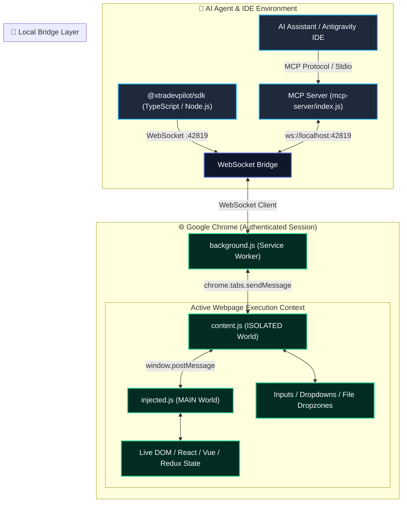

# XtraDevPilot 🚀

> **Autonomous Browser Engineering, QA Automation & Live IDE Bridge powered by the Model Context Protocol (MCP)**

[](https://modelcontextprotocol.io/)
[](https://developer.chrome.com/docs/extensions/)
[](https://www.typescriptlang.org/)
[](LICENSE)

**XtraDevPilot** seamlessly bridges your local AI pair programmer (Google Antigravity, Claude Desktop, Cursor) directly into your live, authenticated Chrome browser. Unlike headless browsers that get blocked by Cloudflare and CAPTCHAs, XtraDevPilot runs inside your real Chrome session—preserving cookies, active logins, credentials, and extensions.

---

## 🏛️ System Architecture



---

## 🧰 Complete Catalog of MCP Tools (27 Available)

XtraDevPilot exposes **27 production-ready MCP tools** organized across key engineering domains:

### 1. Frontend & Full-Stack Development
| Tool Name | Description | Key Parameters |
| :--- | :--- | :--- |
| `execute_script` | Evaluates arbitrary JavaScript in the webpage's `MAIN` execution context. Accesses Redux stores, Zustand, Pinia, window globals, or triggers custom events. | `script`, `tabId` |
| `inject_css` | Dynamically injects raw CSS rules into the live page without reloading. | `cssString` |
| `toggle_layout_debug_mode` | Toggles high-contrast red outlines on all DOM elements to reveal overflow, box boundaries, and margin issues. | _None_ |
| `highlight_element` | Highlights a DOM element with a smooth transition and scrolls it into center view. | `selector`, `tabId` |
| `wait_for_user_click` | Enters "Select Mode" (Inspector Pencil), pausing until the user clicks an element in Chrome, returning clean HTML, computed styles, and inline events. | _None_ |
| `set_viewport_size` | Resizes the Chrome window to test responsive design breakpoints (mobile, tablet, desktop). | `width`, `height` |

### 2. QA Engineering & Automated Testing
| Tool Name | Description | Key Parameters |
| :--- | :--- | :--- |
| `assert_element_state` | Deterministic QA assertion engine (`is_visible`, `is_hidden`, `is_enabled`, `is_disabled`, `contains_text`, `has_value`, `has_attribute`). | `selector`, `condition`, `expected`, `tabId` |
| `record_user_flow` | Captures live user clicks, typing, and navigation, automatically compiling them into a production-ready **Playwright** test file (`.spec.ts`). | `action` (`start`/`stop`/`status`), `tabId` |
| `get_web_vitals` | Audits Core Web Vitals (LCP, CLS, FCP) and resource timing waterfall. | _None_ |
| `run_accessibility_audit` | Scans active page for a11y flaws (missing alt tags, missing button aria-labels, skipped heading levels). | _None_ |
| `run_security_audit` | Scans for plain-text JWTs/secrets in storage, insecure forms, and non-HTTPS traffic. | _None_ |
| `mock_network_response` | Mocks browser `fetch` calls matching a URL pattern with custom status and JSON payloads. | `urlPattern`, `responseBody`, `status` |
| `clear_network_mocks` | Clears all registered in-browser network mocks. | _None_ |

### 3. Web Scraping & RPA Automation
| Tool Name | Description | Key Parameters |
| :--- | :--- | :--- |
| `extract_structured_data` | Universal table and card grid scraper. Parses HTML `<table>` elements and repeated lists into structured JSON. | `targetSelector`, `type` (`table`/`cards`/`list`), `tabId` |
| `scroll_page` | Directional scrolling (`up`, `down`, `top`, `bottom`), pixel delta scrolling, `scrollToSelector`, and inner container scrolling (`overflow: scroll`). | `direction`, `amount`, `scrollToSelector`, `containerSelector`, `tabId` |
| `manage_storage_and_cookies` | Full CRUD on `localStorage`, `sessionStorage`, and Chrome `cookies` (`get`, `set`, `remove`, `clear`). Enables instant persona switching. | `type`, `operation`, `name`, `value`, `domain`, `tabId` |
| `get_storage` | Returns snapshot of local storage, session storage, and active cookies. | _None_ |
| `get_network_logs` | Returns recent network requests made by the tab (methods, status codes, URLs). | _None_ |
| `get_console_logs` | Returns recent browser console errors, warnings, and log messages. | _None_ |
| `capture_screenshot` | Captures visible tab screenshot and saves as a PNG artifact. | `tabId` |

### 4. Enterprise Form & Career Portal Automation
| Tool Name | Description | Key Parameters |
| :--- | :--- | :--- |
| `upload_file` | Attaches local files (`.pdf`, `.docx`) to `<input type="file">` and drag-and-drop zones using `DataTransfer`. | `filePath`, `selector`, `tabId` |
| `batch_fill_form` | Executes 20+ form field assignments in ~200ms using React prototype value setters and auto-selector normalization. | `actions` (`selector`, `value`, `action`), `tabId` |
| `smart_select_combobox` | Automates custom searchable dropdowns (Workday, Greenhouse, ARIA comboboxes, Phenom). | `triggerSelector`, `optionText`, `searchQuery`, `tabId` |
| `extract_job_details` | Scrapes structured job postings and detects the ATS platform (Workday, Phenom, Greenhouse, Lever, LinkedIn). | `tabId` |
| `wait_for_element` | Waits for dynamic elements to appear, become visible, or detach. | `selector`, `timeoutMs`, `state`, `tabId` |
| `type_text` | Simulates user typing with React-compatible event dispatching and 3s auto-wait. | `selector`, `text`, `timeoutMs`, `tabId` |
| `click_element` | Dispatches click with auto-wait and smooth scroll. | `selector`, `timeoutMs`, `tabId` |

### 5. Multi-Tab & Session Management
| Tool Name | Description | Key Parameters |
| :--- | :--- | :--- |
| `open_tab` | Opens a new tab in Chrome and navigates to the URL. | `url` |
| `navigate` | Navigates the target tab to a URL. | `url`, `tabId` |
| `list_tabs` | Lists all open tabs with IDs, titles, URLs, and active states. | _None_ |
| `get_tab_info` | Returns dimensions, URL, status, and favicon of a tab. | `tabId` |
| `get_dom_snapshot` | Returns raw DOM structure. | `tabId` |
| `get_clean_dom_snapshot` | Returns LLM-optimized DOM with optional `rootSelector` scope. | `rootSelector`, `tabId` |

---

## ⚡ TypeScript SDK Guide

Install and use the native TypeScript / Node.js SDK:

```bash
cd sdk
npm install
npm run build
```

### SDK Example: Automated Dev & QA Workflow

```typescript
import { Browser } from '@xtradevpilot/sdk';

async function run() {
  const browser = new Browser({ port: 42819 });
  const page = await browser.getPage();

  // 1. Navigate to target application
  await page.goto('http://localhost:3000');

  // 2. Evaluate runtime Redux store in MAIN context
  const state = await page.evaluate('window.__REDUX_STORE__?.getState()');
  console.log('App state:', state);

  // 3. Batch fill a form in one shot
  await page.batchFill([
    { selector: '#username', value: 'developer', action: 'type' },
    { selector: '#roleSelect', value: 'admin', action: 'select' },
    { selector: '#termsCheckbox', action: 'check' }
  ]);

  // 4. Attach Resume / Document
  await page.uploadFile('./assets/resume.pdf', '#fileUpload');

  // 5. Scrape financial table data
  const report = await page.extractStructuredData('#transactions-table', 'table');
  console.log(`Scraped ${report.count} rows:`, report.data);

  // 6. QA Assertion
  const assertion = await page.assertElement('#success-badge', 'is_visible');
  console.log('Test Passed:', assertion.passed);

  await browser.close();
}

run();
```

---

## 🖥️ Chrome Extension 1-Click Popup

The XtraDevPilot Chrome Extension features an interactive **Quick Actions Dashboard**:

- ⚡ **1-Click Profile Autofill**: Automatically fills candidate details across Phenom People, Workday, Greenhouse, and standard forms.
- ⏺️ **Record Playwright Test**: Click Start, perform manual actions in Chrome, and click Stop to instantly generate and copy a ready-to-run Playwright test script.
- 📊 **Scrape Table to JSON**: 1-click scrapes tables/grids on the active tab and copies the JSON payload to your clipboard.
- 📐 **Toggle Layout Debugger**: Outlines all elements in red to diagnose flexbox, grid, and margin alignment bugs.
- ✏️ **Inspect Element for AI**: Click-to-select element inspector that sends computed styles and HTML back to your IDE.

---

## 🚀 Quickstart Setup

### 1. Configure in Antigravity / Gemini IDE
Add XtraDevPilot to your `mcp_config.json` (`~/.gemini/config/mcp_config.json`):

```json
{
  "mcpServers": {
    "xtradevpilot": {
      "command": "node",
      "args": [
        "C:\\Users\\salun\\OneDrive - smarttech\\Desktop\\D folder\\xtradevpilot\\mcp-server\\index.js"
      ]
    }
  }
}
```

### 2. Load Chrome Extension
1. Open Chrome and go to `chrome://extensions/`.
2. Enable **Developer mode** (top-right toggle).
3. Click **Load unpacked** and select the `extension/` folder.
4. The extension icon will show a green badge when connected to the IDE bridge.

### 3. Verification Testbeds
Open the local testbed pages in Chrome to verify features:
- [test_dev_qa.html](file:///c:/Users/salun/OneDrive%20-%20smarttech/Desktop/D%20folder/xtradevpilot/test_dev_qa.html): Runtime JS evaluation, table scraping, QA assertions, and scrolling.
- [test_automation.html](file:///c:/Users/salun/OneDrive%20-%20smarttech/Desktop/D%20folder/xtradevpilot/test_automation.html): 1-shot batch form filling, PDF resume uploads, and comboboxes.

---

## 📄 License
MIT © XtraDevPilot Team